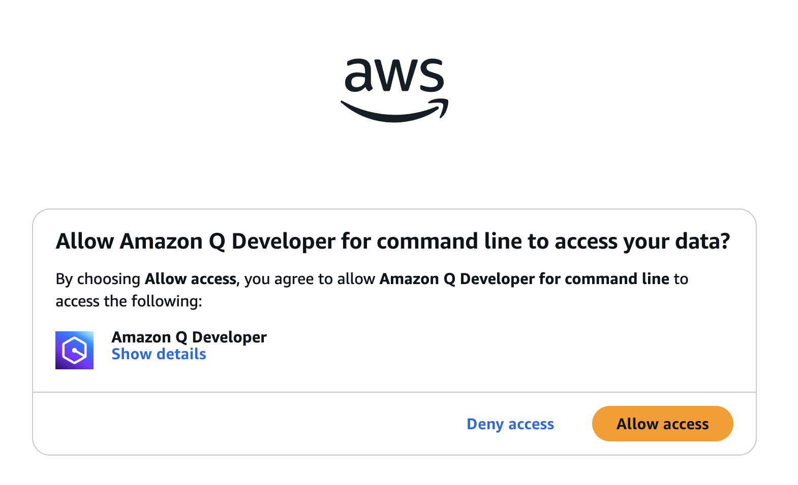
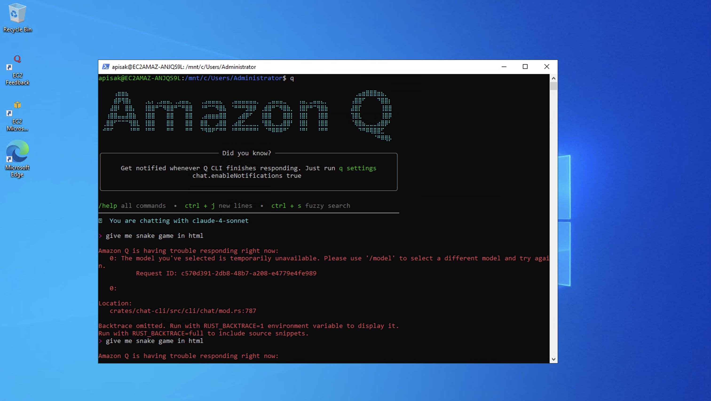

# Setup Guide for Windows Users

This guide will help Windows users set up their development environment for the workshop. The setup involves 4 main steps:

1. Setup WSL (this requires restart laptop)
2. Install Python and its packages
3. Install Amazon Q Developer CLI
4. Install AWS CLI

## Setup WSL

### Install WSL

Run PowerShell with Administrator privilege

**For Windows 10 version 2004 and higher (Build 19041):**
```powershell
wsl --install
```

**For older version:**
```powershell
wsl --install --enable-wsl1 --no-launch
```


### Restart laptop

After installation, restart your laptop.

### Set WSL default version

Set WSL default version (depends on windows version)

**For Windows 10 version 2004 and higher (Build 19041):**
```powershell
wsl --set-default-version 2
```

**For older version:**
```powershell
wsl --set-default-version 1
```


### Install Distro (Ubuntu)

```powershell
wsl --install -d Ubuntu
```


### Create Linux User and Password

Once installed, you'll be prompted to create linux user and password.


### Enter WSL Distro

Then you will enter to WSL distro (ubuntu)


## Install Python and its Package

### Open WSL Ubuntu Distro

Open WSL ubuntu distro (if you haven't done so)

### Install Required Packages and Python3

```bash
sudo apt-get install -y python3 curl unzip
```

### Verify Python Installation

```bash
python3 --version
```


### Install uv Package

```bash
curl -LsSf https://astral.sh/uv/install.sh | sh
source $HOME/.local/bin/env
uv --version
```


## Install AWS CLI

**Ensure you are entered into WSL, not PowerShell.**

### Download and Install AWS CLI Version 2

```bash
curl "https://awscli.amazonaws.com/awscli-exe-linux-x86_64.zip" -o "awscliv2.zip"
unzip awscliv2.zip
sudo ./aws/install
```

### Verify Installation

```bash
aws --version
```


## Install Amazon Q Developer CLI

Check at https://docs.aws.amazon.com/amazonq/latest/qdeveloper-ug/command-line-installing-ssh-setup-autocomplete.html

### Open Installed Distro Using WSL Command

Open installed distro using WSL command (if haven't done so)

### Check gLibc Version

```bash
ldd --version
```


### Download Zip File and Unzip

```bash
curl --proto '=https' --tlsv1.2 -sSf "https://desktop-release.q.us-east-1.amazonaws.com/latest/q-x86_64-linux.zip" -o "q.zip"
unzip q.zip
```

### Execute Shell Script to Install Amazon Q Developer CLI

```bash
./q/install.sh
```

**For choice, please follow:**
- Do you want q to modify your shell config: **Yes**


### Select Login Method

Select login method: **Use for Free with Builder ID**


### Open URL Showing in Console

Register new or login your AWS Builder ID


### Authorize Request


### Allow Access



### Confirm and Continue

Confirm and continue → Allow access


## Using Amazon Q Developer CLI

### Start Q Chat

```bash
q chat
```

(or just `q` for shorter)


### Model Selection Issue

For free user (using AWS Builder ID), it might have issue to use Claude 4 sonnet model. Please change to Claude 3.7 is also fine for now.



### Change Model

```bash
/model
```

Choose 3.7 then enjoy with your idea


### Test Prompts


### See Results


---

**Note:** This setup guide is prepared for the workshop on 2025-07-18. Make sure to follow each step carefully and restart your laptop when required during the WSL installation process.
